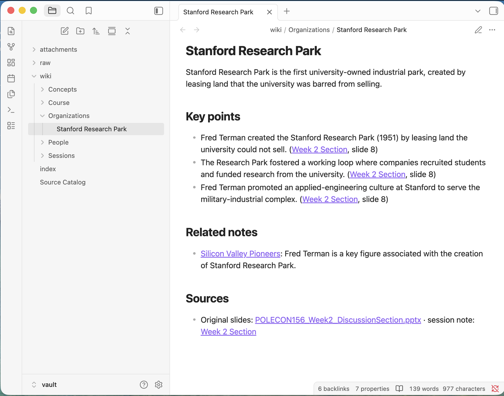
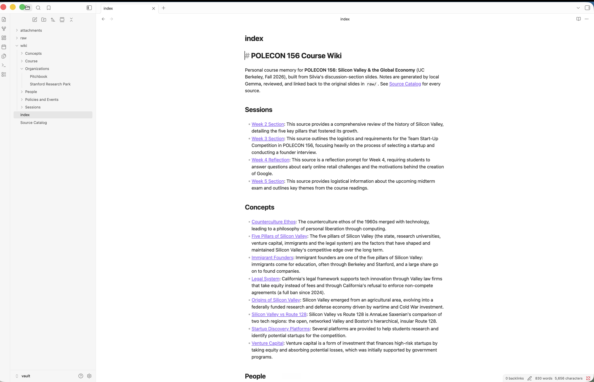
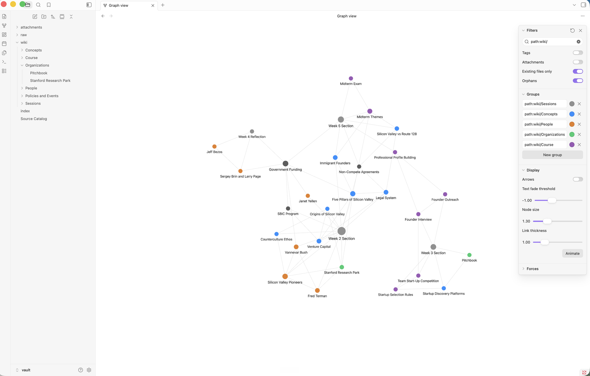
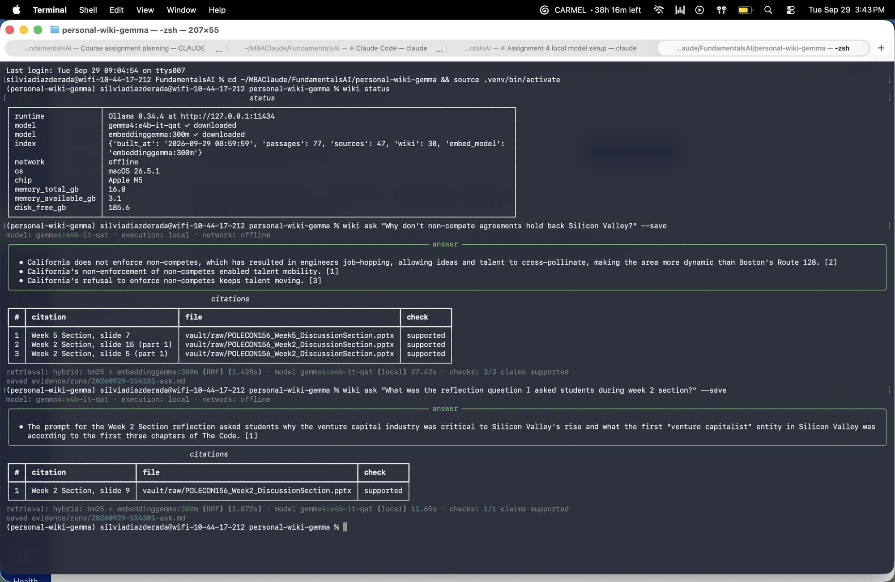

# POLECON 156 Course Wiki: local Gemma + RAG

A personal wiki and command-line assistant for **POLECON 156: Silicon Valley & the Global Economy** (UC Berkeley, Fall 2026), built from my own discussion-section slides as a GSI. Everything runs on my laptop with a local Gemma model through Ollama, and works with the internet switched off.

```
wiki ingest   read my slides → Gemma writes linked Obsidian notes → rebuild the search index
wiki search   show the original slide passages that match (no AI answer, no model needed)
wiki ask      neutral, cited answer from the slides only, or "insufficient evidence"
wiki chat     "Sol", a teaching-assistant persona with conversation memory; looks up notes only when needed
```

**Jump to:** [Setup](#setup) · [Device and model](#device-model-and-measurements) · [Architecture](#architecture-how-a-question-reaches-gemma) · [Design choices](#design-choices) · [Wiki in Obsidian](#the-wiki-in-obsidian) · [Evidence](#evidence) · [Offline demo](#offline-demonstration) · [Reflection](#reflection-failures-limitation-improvement)

| What | Where |
|---|---|
| CLI + harness code | [`wikicli/`](wikicli/) (entry point [`cli.py`](wikicli/cli.py), harness [`harness.py`](wikicli/harness.py)) |
| Instructions loaded by the harness | [`prompts/wiki-instructions.md`](prompts/wiki-instructions.md) (research rules, ask), [`prompts/persona.md`](prompts/persona.md) (Sol, chat), [`prompts/router.md`](prompts/router.md), [`prompts/ingest-topics.md`](prompts/ingest-topics.md), [`prompts/ingest-links.md`](prompts/ingest-links.md) |
| Original sources (unchanged) | [`vault/raw/`](vault/raw/) |
| Wiki notes / index / source catalog | [`vault/wiki/`](vault/wiki/) · [`vault/index.md`](vault/index.md) · [`vault/Source Catalog.md`](vault/Source%20Catalog.md) |
| Test set (answer key, outside the vault) | [`tests/questions.yaml`](tests/questions.yaml) |
| Four ask-mode evidence cards (offline) | [`evidence/ask-tests-offline/`](evidence/ask-tests-offline/) |
| Chat / search mode checks (offline) | [`evidence/mode-checks-offline/mode-checks.md`](evidence/mode-checks-offline/mode-checks.md) |
| Offline demonstration | [`evidence/offline-run/`](evidence/offline-run/) + [screenshot](evidence/screenshots/offline-demo-wifi-off.png) |
| Configuration | [`config.toml`](config.toml) |

---

## Purpose and sources

**What the wiki is for.** A "course memory" I can use while teaching sections: what did we cover, which slide says it, what did I ask students in a reflection, what are the midterm logistics. Questions it should answer: facts from the five pillars of Silicon Valley (state, universities, venture capital, immigrants, legal system), people and programs from the slides (Terman, Vannevar Bush, the SBIC), the team start-up project, and midterm logistics.

**Sources** (all four are my own section decks; slides + speaker notes are read):

| Source ID | File | Slides | Content |
|---|---|---|---|
| `week-2-section` | [POLECON156_Week2_DiscussionSection.pptx](vault/raw/POLECON156_Week2_DiscussionSection.pptx) | 17 | History of Silicon Valley, the five pillars, Janet Yellen talk |
| `week-3-section` | [POLECON156_Week3_DiscussionSection.pptx](vault/raw/POLECON156_Week3_DiscussionSection.pptx) | 10 | Team start-up competition, choosing a startup, founder interviews |
| `week-4-reflection` | [POLECON156_Week4_Reflection.pptx](vault/raw/POLECON156_Week4_Reflection.pptx) | 1 | Week 4 reflection prompt |
| `week-5-section` | [POLECON156_Week5_DiscussionSection.pptx](vault/raw/POLECON156_Week5_DiscussionSection.pptx) | 12 | Midterm logistics and themes, Route 128 comparison |

**Privacy and permissions.** Only my own section materials are included. The professor's lecture decks are excluded (no permission to republish). In the Week 3 deck, slides 4–5 listed student team rosters with full names; I removed those two slides before adding the file here (FERPA). That file is otherwise unchanged; all slide numbers refer to the redacted file. The harness never edits anything in `raw/`.

**How originals connect to generated pages.** Each source gets a stable ID and a SHA-256 hash in the [Source Catalog](vault/Source%20Catalog.md). Every wiki note lists its sources as links back to the original file and slide numbers (e.g. `Week 2 Section, slides 6, 8`). Each source also gets a session note (`wiki/Sessions/Week 2 Section.md`) linking to all notes built from it.

---

## Setup

Tested on macOS 26.5.1, Apple M5, 16 GB. Needs Python 3.12+, [uv](https://docs.astral.sh/uv/), and [Ollama](https://ollama.com/download).

**1. While online: install and download everything**

```bash
# Ollama runtime (0.34.4 used here) — download the macOS app from https://ollama.com/download
ollama pull gemma4:e4b-it-qat      # generation model, Q4_0 (default)
ollama pull gemma4:e2b-it-qat      # optional smaller model, used in the benchmark
ollama pull embeddinggemma:300m    # local embedding model for retrieval
ollama list                        # confirm all three are stored locally

git clone https://github.com/silviadiazderada/personal-wiki-gemma.git
cd personal-wiki-gemma
uv sync                            # installs typer, rich, httpx, numpy, rank-bm25, python-pptx, pypdf, pyyaml, psutil
source .venv/bin/activate          # makes the `wiki` command available
```

Model weights are not in this repo. Official source: the Ollama library pages for [gemma4](https://ollama.com/library/gemma4) and [embeddinggemma](https://ollama.com/library/embeddinggemma) (Google's Gemma open weights, [Gemma docs](https://ai.google.dev/gemma/docs)).

**2. Build the wiki and run it (works offline from here)**

```bash
wiki --help                                     # commands, configuration, required inputs
wiki status                                     # model, runtime, index, network status
wiki ingest vault/raw                           # read sources → notes → index (skips unchanged files)
wiki ingest vault/raw/POLECON156_Week4_Reflection.pptx --force   # re-run Gemma on one source
wiki search "Stanford land lease"               # original passages + paths, no answer
wiki ask "How did Stanford turn its real estate into an advantage for the tech industry?"
wiki ask "..." --save --show-context            # also save an evidence card / print passages
wiki chat                                       # Sol; /notes <query> forces a lookup, /save keeps a draft, /reset, /quit
wiki eval --label offline                       # four ask tests + chat/search mode checks → evidence/
wiki bench                                      # memory + response time per model
```

Open **`vault/`** (not the repo root) as the Obsidian vault.

Errors are handled with plain messages: Ollama not running, a model not pulled, a missing file or empty index each print what to do next instead of a stack trace. `wiki search` still works when Ollama is off (it falls back to keyword search).

**Optional online mode** (extension, not needed for anything above): `wiki ask "..." --mode online` sends the question and the retrieved passages to Google's hosted `gemma-3-27b-it` via the Gemini API. It needs `GEMINI_API_KEY` in the environment and is never used unless requested. I did not submit online-mode evidence; every result in this repo is local.

---

## Device, model and measurements

| | |
|---|---|
| Device | MacBook Air, Apple **M5**, macOS 26.5.1 |
| Memory | **16 GB unified** (CPU and GPU share it; no dedicated VRAM). Typically only **1–3 GB free** with my usual apps open |
| Disk free | ~185 GB |
| Runtime | **Ollama 0.34.4**, local HTTP API at `127.0.0.1:11434` (Metal GPU) |
| Generation model | **`gemma4:e4b-it-qat`**: Gemma 4 E4B, instruction-tuned, quantization-aware trained, **Q4_0**, 6.1 GB file, context 8,192 (16,384 for ingestion) |
| Smaller model tested | `gemma4:e2b-it-qat`: Gemma 4 E2B, Q4_0, 4.3 GB file |
| Embedding model | **`embeddinggemma:300m`** (EmbeddingGemma 308M, BF16, 621 MB) |
| Settings | temperature 0.2, seed 42, `keep_alive` 10 min ([`config.toml`](config.toml)) |

**Measured on this laptop** (one RAG answer, test-1 question, [`wiki bench`](evidence/bench/20260928-180002.md)):

| Model | Load | Cold answer | Warm answer | Speed | Memory held by Ollama | System memory increase |
|---|---|---|---|---|---|---|
| `gemma4:e2b-it-qat` | 4.6 s | 15.2 s | 7.2 s | 24.9 tok/s | 3.7 GB | 4.0 GB |
| `gemma4:e4b-it-qat` | 6.1 s | 28.1 s | 14.7 s | 12.7 tok/s | 5.4 GB | 5.0 GB |

Two stress runs show what happens when the Mac is short on memory (1.2 GB free): [under memory pressure](evidence/bench/under-memory-pressure/20260928-172136.md) and [heavy multitasking, offline](evidence/bench/heavy-multitasking/20260928-172409.md). Both models still answered, but E4B's warm answer slowed to 23–30 s.

**Ingestion** (all four decks, forced full run with E4B, 2026-09-28): **544 s total, 349 s of it in the model**; Ollama held 5.6 GB (E4B) + 0.7 GB (embeddings); system memory in use 14.6 of 16 GB. A normal re-run with unchanged files takes about 1.5 s because unchanged sources skip the model.

**Why E4B.** Both sizes fit a 16 GB Mac and **both pass all four ask tests** ([E2B cards](evidence/ask-tests-e2b/README.md), [E4B cards](evidence/ask-tests-e4b/README.md)), so for answering, E2B is the smallest model that works, and it is twice as fast. The difference showed up in **ingestion**: E2B produced sentence-like or task-like note titles ("Team Start-Up Competition Structure", "Legal System Impact", "Practice Essay Questions") and weaker links ([E2B ingest](evidence/iterations/ingest-1-e2b/index.md) vs [E4B ingest](evidence/iterations/ingest-2-e4b/index.md)). Ingestion runs rarely and quality there is what I read in Obsidian, so I use E4B as the default. With little free memory, `wiki ask "..." --model gemma4:e2b-it-qat` is the fast option. The 26B MoE was not considered: it needs ~14 GB just to load, and this Mac has 16 GB total.

---

## Architecture: how a question reaches Gemma

The **model** (Gemma) only turns text into text. It does not read my files, remember past chats, or call tools. Everything else is code in this repo:

| Piece | What it is here |
|---|---|
| **Model** | Gemma via Ollama's HTTP API ([`llm.py`](wikicli/llm.py)). Local by default; online is a separate backend class. |
| **Retrieval tool** | [`retrieval.py`](wikicli/retrieval.py): BM25 keyword search + EmbeddingGemma vector search over slide passages, merged with Reciprocal Rank Fusion. Returns passages with file path and slide. `wiki search` shows its output directly. |
| **RAG workflow** | `ask`: retrieve → put passages + research rules in the prompt → Gemma answers from them. RAG adds context at answer time; it does not train Gemma. |
| **Harness** | [`harness.py`](wikicli/harness.py) and friends: picks the mode, loads the right instructions, keeps chat history, decides whether to retrieve, builds prompts ([`prompts.py`](wikicli/prompts.py)), calls Gemma, checks citations ([`citations.py`](wikicli/citations.py)), handles errors, saves logs and evidence ([`evidence.py`](wikicli/evidence.py)). |
| **CLI** | [`cli.py`](wikicli/cli.py) (Typer + Rich): parses `wiki <command>` and prints results. |

**One path, traced: `wiki ask "How did Stanford turn its real estate into an advantage?"`**

1. `cli.py` `ask()` loads [`config.toml`](config.toml) and builds a `Harness(mode="local")`.
2. `Harness.ask()` checks that Ollama is up and the model is pulled (`llm.check()`), else prints a clear error.
3. **Retrieve:** `Retriever.search(question, k=6, kinds=("source",))`. Only original slide passages count as evidence, not generated notes. BM25 finds exact words; the embedding search finds "land" for "real estate". RRF merges both lists.
4. **Build the prompt:** `prompts.ask_messages()` = research rules from `wiki-instructions.md` + the 6 numbered passages (each labelled with source and slide) + the question. No persona, no chat history.
5. **Call Gemma** with a JSON schema: a list of claims, each with passage numbers, then `status` (`answered` / `insufficient_evidence`), then a note.
6. **Check citations** (`verify_answer`): every cited number must be a retrieved passage; every number in a claim (years, dollars, percentages) must appear in the cited passages; and at least half the claim's content words must be there. If no claim survives, the harness reports insufficient evidence instead of showing the answer.
7. **Display and save:** the CLI prints the answer, a citations table with file paths and a `supported / weak / unsupported` check per claim, then timing and model identity. The run is logged; `--save` writes an evidence card.

**How the three modes differ** (enforced by the harness, not by hoping the model behaves):

| | search | ask | chat |
|---|---|---|---|
| Calls Gemma | never | always | always |
| Retrieval | always | always (sources only) | only when the router says the turn needs notes |
| Instructions | none | `wiki-instructions.md` (neutral, cite, or refuse) | `persona.md` (Sol, a TA voice with an accurate list of what it can do) |
| Conversation history | no | **no**, each question stands alone | last 8 turns |
| Output | passages + paths | JSON claims → verified answer or "insufficient evidence" | streamed reply; cites `[n]` only for retrieved notes |

**Chat's retrieval decision** ([`ChatSession.route`](wikicli/harness.py)): first, fixed rules skip retrieval for greetings, "what can you do / help me with", and edits like "make that shorter". `/notes <query>` forces a lookup. Otherwise a small Gemma call with [`router.md`](prompts/router.md) returns `needs_notes` and a standalone search query. If that call fails, chat retrieves anyway to be safe. Chat history is conversation, never evidence: `ask` never sees it. Drafts are saved to `outputs/` only when I type `/save`, never into the vault.

---

## Design choices

- **Passages.** One passage per slide (title + body + speaker notes), because slides are already one idea each. Slides over 220 words are split into parts (`slide 5 (part 2)`). Repeated slide chrome (course footer) is removed. 47 source passages from the four decks (plus 30 wiki-note passages used for navigation in `search` and `chat`, never as `ask` evidence).
- **How much text goes to Gemma.** `ask` sends the top 6 passages (roughly 1,000–1,500 words) inside an 8,192-token context. `chat` sends 4 when it retrieves. Ingestion sends one whole deck at a time, so it uses a 16,384-token context.
- **Retrieval method.** Hybrid, because each half fixes the other's blind spot: BM25 handles names and numbers ("SBIC", "1958"), embeddings handle paraphrase (test-2 says "real estate", the slide says "land"). Queries and passages use EmbeddingGemma's recommended task prefixes (`task: search result | query:`). If the embedding model is down, retrieval falls back to BM25.
- **Research rules** ([`wiki-instructions.md`](prompts/wiki-instructions.md)): answer only from the numbered passages, cite each claim, neutral voice, no outside knowledge, "insufficient evidence" only when no passage addresses the question.
- **Assistant personality** ([`persona.md`](prompts/persona.md)): Sol, a warm, concise teaching assistant. It says what it can actually do, labels ideas as suggestions, and never invents facts about me or my students.
- **Model settings that mattered.** Temperature 0.2 and a fixed seed made runs repeatable. The **order of fields in the JSON schema** mattered most: see [iteration 1](#reflection-failures-limitation-improvement).
- **Note names and folders.** Gemma proposes topics; the harness cleans each title (2–6 words, title case, no "week/slide/summary", no questions, no IDs) and rejects bad ones. Folders: `Concepts/`, `People/`, `Organizations/`, `Policies and Events/`, `Course/`, plus `Sessions/` (one note per deck). The first heading always matches the filename.
- **Source IDs → readable pages.** Machine IDs (`week-2-section`, passage ids like `week-2-section:s13`) and hashes live in note properties, [`data/source_catalog.json`](data/source_catalog.json) and the Source Catalog, never in filenames.
- **Re-ingestion without duplicates.** Unchanged files (same hash) skip the model. Each new topic is matched to existing notes by a normalised title key (ignoring case, "the", plurals), then by an embedding check plus a Gemma "same subject?" judge, so a re-run **updates** the note instead of creating a copy. Notes I reviewed (`reviewed: true`) are never overwritten, and `wiki rename` / `wiki merge` record their changes so a re-ingest can't bring old machine-style names back. Machine state is in [`data/wiki_state.json`](data/wiki_state.json), outside the vault. Proof: [`evidence/reingest/`](evidence/reingest/).
- **Links.** Gemma picks related notes for each note, but only from the list of real titles, and must give a reason ("why it's relevant"), so there are no broken links. The index is navigation; the meaningful links are inside the notes.

---

## The wiki in Obsidian

30 notes in `vault/wiki/`, grouped by topic in [`vault/index.md`](vault/index.md). I reviewed every generated note against the slides and fixed the errors in the wiki rather than in the evidence; all corrections are listed in [`evidence/review-log.md`](evidence/review-log.md) (e.g. a wrong Shockley date, a misattributed Community Memory founder, a dropped "$2–$3 per $1" figure, a fact citing the wrong slide).

| 1 · An open note with sources and related-note links | 2 · The topic-organized index and page list |
|---|---|
|  |  |

**3 · Graph view.** Filter `path:wiki/`, Attachments off, colour groups by folder (grey Sessions, blue Concepts, orange People, green Organizations, purple Course).



**Tracing one note back to evidence:** `index.md` → **SBIC Program** (Policies and Events) → related note **Venture Capital** (link reason: *"the SBIC multiplied the early risk-capital pool and seeded the Valley's first VC firms"*) → its source reference *Week 2 Section, slides 5, 13* → [Source Catalog](vault/Source%20Catalog.md) → `raw/POLECON156_Week2_DiscussionSection.pptx`, slide 13, which states the "$2–$3 of low-cost government money for every $1" figure. All internal links resolve in Obsidian (checked by clicking through from the index).

---

## Evidence

### Four ask-mode tests

Questions, expected passages and expected answers were written **before** retrieval was built, in [`tests/questions.yaml`](tests/questions.yaml), outside the vault so retrieval can never find the answer key. Each card shows the question, expectations, every retrieved passage with path, slide and scores, the model, local/online and network state, the raw Gemma output, the answer with citations, the automatic claim checks, and my own assessment.

**Required run (internet off):** [`evidence/ask-tests-offline/`](evidence/ask-tests-offline/README.md)

| Test | Type | Question | Expected source | Result |
|---|---|---|---|---|
| [test-1](evidence/ask-tests-offline/test-1.md) | direct, one source | What was the SBIC program and how did it multiply venture capital? | Week 2, slide 13 | ✅ answered, 3/3 claims supported, 20.5 s |
| [test-2](evidence/ask-tests-offline/test-2.md) | paraphrased | How did Stanford turn its real estate into an advantage for the tech industry? | Week 2, slide 8 | ✅ answered, 1/1 supported, 13.1 s |
| [test-3](evidence/ask-tests-offline/test-3.md) | connects two sources | How did California's treatment of non-compete agreements shape Silicon Valley? | Week 2 slide 15 + Week 5 slide 7 | ✅ answered, 3/3 supported, 19.5 s |
| [test-4](evidence/ask-tests-offline/test-4.md) | unanswerable | What was the U.S. capital gains tax rate in 1990? | none | ✅ insufficient evidence, 10.1 s |

**Do the citations support the claims?** I opened each cited slide:
- **test-1:** slide 13 states the 1958 Act, the licensing of private funds and the "$2–$3 for every $1" leverage. Supported.
- **test-2:** retrieval found slide 8 despite the wording change ("real estate" vs "land"); it states Terman leased the land that Stanford could not sell, creating Stanford Research Park in 1951. Supported.
- **test-3:** claims cite both Week 2 slide 15 (no non-competes → job-hopping, cross-pollination, vs Route 128) and Week 5 slide 7 (labor rules → talent mobility). Supported, and the answer connects the two decks. A third claim (from Week 2 slide 5) adds that Valley law firms took equity instead of fees: accurate to the slide, but only loosely relevant to the question.
- **test-4:** no passage mentions capital gains taxes. Retrieval still returns its closest passages (Yellen on tariffs, the SBIC), and Gemma returned insufficient evidence without guessing a number. Correct behavior.

Answer times offline (10–21 s) are slower than the benchmark because the run also held the embedding model and other apps in 16 GB. Earlier online runs of the same tests, kept for comparison: [E4B](evidence/ask-tests-e4b/README.md), [E2B](evidence/ask-tests-e2b/README.md).

### Chat / search mode checks

[`evidence/mode-checks-offline/mode-checks.md`](evidence/mode-checks-offline/mode-checks.md) (internet off) has a transcript and automatic checks for:

- **"what can we do?" / "what can you help me with?"**: Sol describes its real capabilities; no notes lookup, no citations, no "insufficient evidence".
- **Follow-up:** "Draft a short plan for my 50-minute midterm review section" (retrieves notes and cites them), then **"make that shorter"**: uses the conversation, skips retrieval, and the reply is shorter.
- **Search:** returns original passages and paths with no generated answer.
- **Ask ignores chat:** a false claim is made in chat ("Stanford Research Park opened in 1975"); a later `wiki ask` answers 1951 from the slide and does not repeat 1975. Chat is not evidence.

---

## Offline demonstration

Wi-Fi off, each command a fresh process (so the CLI is restarted), models already downloaded. The full terminal transcript is in [`evidence/offline-run/`](evidence/offline-run/):

1. `wiki --help` and `wiki status` (network: **offline**, model and runtime identity, device specs)
2. `wiki ingest vault/raw/POLECON156_Week4_Reflection.pptx --force`: Gemma re-reads a source offline; reviewed notes are kept and no duplicates appear
3. `wiki eval --label offline`: all four ask tests + all chat/search mode checks
4. `wiki search`, and two `wiki ask` questions typed by hand

**What the offline ingestion showed:** Gemma re-read the Week 4 deck offline, proposed updates to its three notes, and the harness kept my reviewed versions (`kept_reviewed`), rejected a task-style title ("Written Reflection"), created **no** new or duplicate notes, and rebuilt the index (47 source passages + 30 wiki notes). A folder comparison against a backup taken just before the run confirmed the wiki files were unchanged.

Every evidence card records `network: offline` and `execution: local`. No hosted embeddings, remote search or cloud fallback exist in local mode.



*Two questions I typed with Wi-Fi off. `wiki status` reports `network: offline`, and each answer shows `execution: local · network: offline` with checked citations ([saved cards](evidence/runs/)).*

---

## Reflection: failures, limitation, improvement

All earlier results are kept in [`evidence/iterations/`](evidence/iterations/) so improvements can be checked.

**Iteration 1: E2B refused everything.** The first ask run answered "insufficient evidence" to all four tests, including the three answerable ones, even though retrieval had found the right slides ([log](evidence/iterations/run1-e2b-status-first-overrefusal.jsonl)). *Cause:* the JSON schema asked for `status` first. Ollama generates keys in schema order, so the model decided to give up before writing any claims. *Fix:* claims first, status last ([`prompts.py`](wikicli/prompts.py)). All three answerable tests then passed on both models.

**Iteration 2: my citation checker was wrong, not the model.** E4B's test-2 came back as "insufficient evidence" ([cards](evidence/iterations/eval-1-e4b-verifier-bug/README.md)). *Cause:* the verifier read the `[1]` citation marker inside a claim as the number "1", didn't find it in the passage, and rejected a correct claim. *Fix:* strip citation markers before checking numbers, then re-test that a fake year ("1975") is still caught.

**Iteration 3: re-ingestion rewrote the wiki.** Forcing Gemma to re-read the Week 2 deck merged *Legal System* into a new "Labor Rules" note and deleted *Fred Terman* and *Non-Compete Agreements* ([attempt 1, failed](evidence/reingest/attempt-1-FAILED-context-dependent.md)). *Cause:* the note set followed whatever topics the model happened to return on that run. *Fix:* keep existing notes unless a topic clearly matches one (title key, then embedding + Gemma "same subject?" judge), never overwrite human-reviewed notes, and make `rename`/`merge` permanent. Re-running then updated notes in place with no duplicates ([attempts 2–3](evidence/reingest/)).

**A limitation I still see.** In the offline demo, Gemma answered the non-compete question with three bullets that say the same thing ("keeps talent moving", "enabled talent mobility"), each citing a different slide ([card](evidence/runs/20260929-154151-ask.md)). Every claim is correctly supported, so my checker passes it, but it reads as padding. *Cause:* the schema asks for a list of claims, each with its own citation, so the model makes one claim per passage instead of one claim with several citations. *Improvement I'd try:* merge claims whose content words overlap heavily into a single claim that keeps all their citations, and add a rule to `wiki-instructions.md`: "one claim per distinct fact; cite several passages on the same claim".

**Other honest limits.** Speed depends on free memory: with Chrome open and ~1 GB free, E4B answers take 20–30 s. The citation checks are word-overlap heuristics; they catch invented numbers and wrong citations but not a subtle paraphrase that changes meaning, so I still read the cited slides myself (recorded in each card). The wiki is small (4 decks, 30 notes) by design, so every note could be reviewed by hand.

---

*Built for Fundamentals of AI (UC Berkeley MBA), Assignment 4, with Claude Code as a coding assistant. The course content, source choices, test questions and every correction in the review log are mine.*
